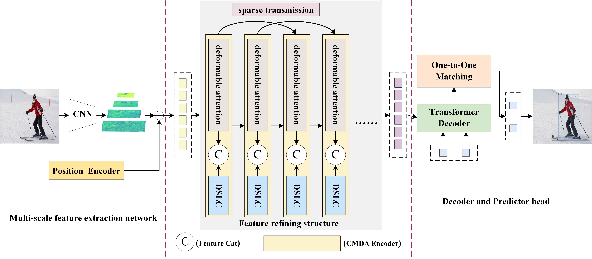
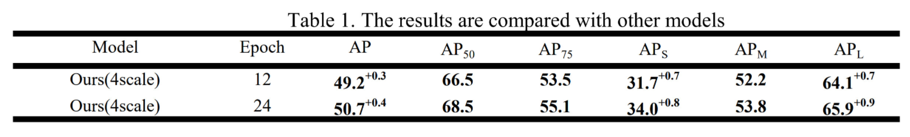
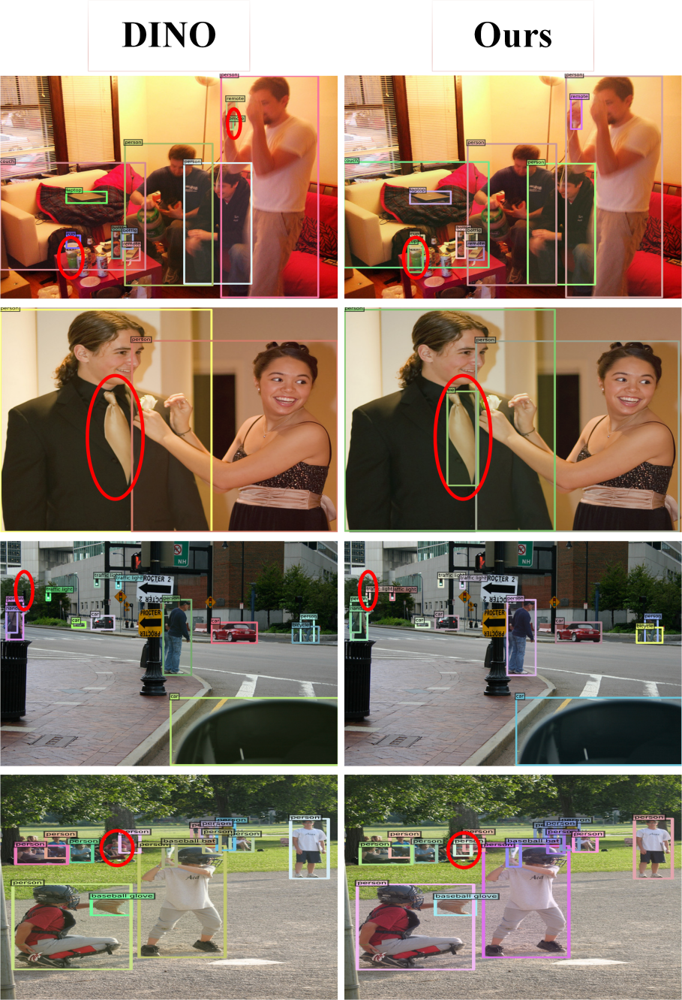
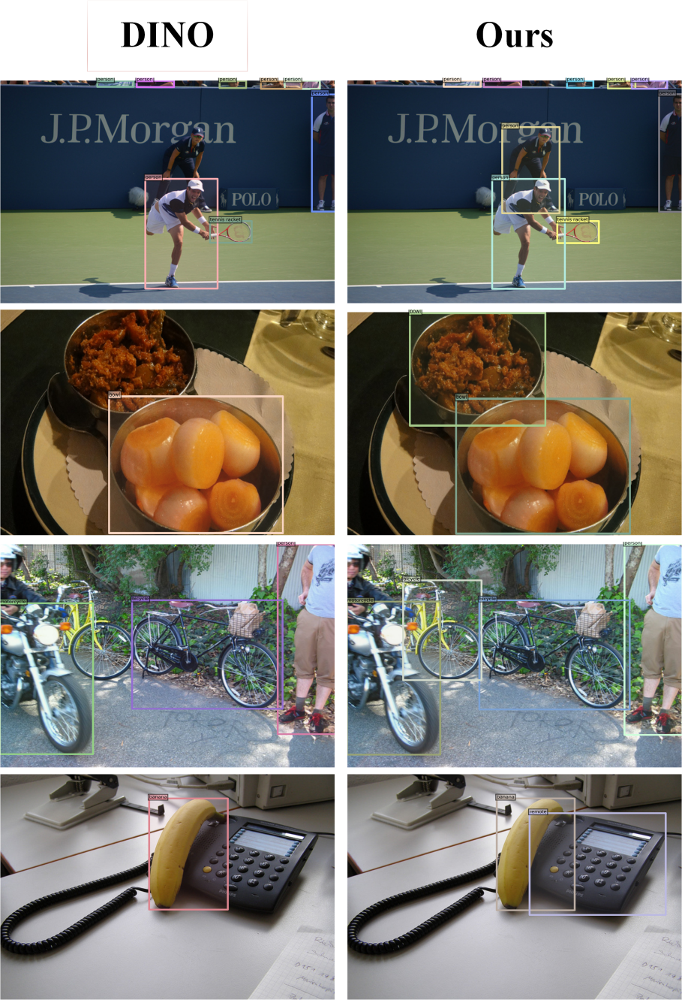

# End-to-End Target Detection Enhanced by Hierarchical Convolution Modulation and Sparse Attention Transmission 

This is the official implementation of the paper "[End-to-End Target Detection Enhanced by Hierarchical Convolution Modulation and Sparse Attention Transmission](https://github.com/gzyao/detr-project)". 

Authors: [Lixin he]\*, [Guangzhuang Yao]\*,[Zhi Cheng]\*,[Xiaofeng Wang]\*,[Zhi Hu]\*,[Luqing Ge]\*,[Jie Li]\*.

## Data
<details>
  <summary>Data</summary>

Please download [COCO 2017](https://cocodataset.org/) dataset and organize them as following:
```
COCODIR/
  ├── train2017/
  ├── val2017/
  └── annotations/
  	├── instances_train2017.json
  	└── instances_val2017.json
```
</details>

# Abstract
This study proposes an end-to-end target detection model that significantly improves accuracy, particularly for both large and small targets. The key innovations lie in the hierarchical convolution modulation of deformable attention and a sparse feature transmission strategy. By modulating deformable attention with convolution, our approach enables effective extraction of both global and local features. Additionally, a deep-shallow layered convolutional module is employed to enhance coarse- and fine-grained feature extraction. The sparse transmission strategy ensures optimal feature output from the encoder layers. Experimental results on the MS-COCO dataset demonstrate the effectiveness of our approach, achieving state-of-the-art performance with notable gains in detection accuracy for both small and large targets.

# Highlights
1. Multi-scale features are convolved in deep and shallow layers.
2. The traditional deformable attention mechanism is modulated by the layered convolution mentioned above.
3. The sparse feature transmission ensures the optimal output of the last layer encoder.


# Methods



# Experimental


# Detection effect comparison with DINO
## small targets


## big targets



## Run

<details>
  <summary>1. Eval our pretrianed models</summary>

  <!-- ### Eval our pretrianed model -->
  Download our DINO model checkpoint "checkpoint0011_4scale.pth" from [this link](https://drive.google.com/drive/folders/1qD5m1NmK0kjE5hh-G17XUX751WsEG-h_?usp=sharing) and perform the command below. You can expect to get the final AP about 49.0.
  ```sh
  bash scripts/DINO_eval.sh /path/to/your/COCODIR /path/to/your/checkpoint
  ```

</details>


<details>
  <summary>2. Inference and Visualizations</summary>

For inference and visualizations, we provide a [notebook](inference_and_visualization.ipynb) as an example.

</details>


<details>
  <summary>3. Train a 4-scale model for 12 epochs</summary>

We use the DINO 4-scale model trained for 12 epochs as an example to demonstrate how to evaluate and train our model.

You can also train our model on a single process:
```sh
bash scripts/DINO_train.sh /path/to/your/COCODIR
```

</details>


<details>
  <summary>4. Supports for Swin Transformer</summary>

To train Swin-L model, you need to first download the checkpoint of Swin-L backbone from [link](https://github.com/SwinTransformer/storage/releases/download/v1.0.0/swin_large_patch4_window12_384_22k.pth) and specify the dir of the pre-trained backbone when running the scripts. Here is an example.
```
bash scripts/DINO_train_submitit_swin.sh /path/to/your/COCODIR /path/to/your/pretrained_backbone 
```

</details>


<details>
  <summary>5. Distributed Run</summary>

As the training is time consuming, we suggest to train the model on multi-device.

If you plan to train the models **on a cluster with Slurm**, here is an example command for training:
```sh
# for DINO-4scale: 49.0
bash scripts/DINO_train_submitit.sh /path/to/your/COCODIR

# for DINO-5scale: 49.4
bash scripts/DINO_train_submitit_5scale.sh /path/to/your/COCODIR
```
Notes:
The results are sensitive to the batch size. We use 16(2 images each GPU x 8 GPUs for DINO-4scale and 1 images each GPU x 16 GPUs for DINO-5scale) by default.

Or run with **multi-processes on a single node**:
```sh
# for DINO-4scale: 49.0
bash scripts/DINO_train_dist.sh /path/to/your/COCODIR
```

</details>

</details>


<details>
  <summary>6. Training/Fine-tuning a DINO on your custom dataset</summary>

To train a DINO on a custom dataset **from scratch**, you need to tune two parameters in a config file:
- Tuning the `num_classes` to the number of classes to detect in your dataset.
- Tuning the parameter `dn_labebook_size` to ensure that `dn_labebook_size >= num_classes + 1`

To **leverage our pre-trained models** for model fine-tuning, we suggest add two more commands in a bash:
- `--pretrain_model_path /path/to/a/pretrianed/model`. specify a pre-trained model.
- `--finetune_ignore label_enc.weight class_embed`. ignore some inconsistent parameters.

</details>

